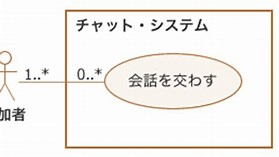
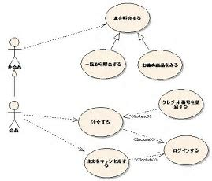

## 概要
- システム開発の初期段階に利用するUML
- 外から見た（ユーザ視点の）システムの挙動
- 構成する４つ
    - **アクター**
    - **ユースケース**
    - **関係**
    - **システム境界**

## アクター
- 人型のアイコン　（**UML2.0から人型以外もOK**）
- 利用者、他システムを表す

## ユースケース
- 楕円の内部に文字
- 外から見た機能の１つ
- １ユースケースの目安は、目的が達成されるレベル
- 名刺・動詞は特に指定は無いが、統一した方が良いよねーくらい

## 関係
- アクターとユースケースをつなぐ線
- 数値を入れて多重度を示すことができる  

- **汎化**：アクター同士、ユースケース同士を矢印をつなぐと、先の関係を全て持つ事を表せる  
  
↑下のアクターは上のアクターの関係を持っている  
ユースケースは先の性質を持っている
- **包含**（ほうがん）：ユースケース同士で共通性質を持つ場合`<<include>>`を付与して外付けできる（↑図の「ログインする」部分）
- **拡張**：「利用されることがある」くらいのオプション的な性質を`<<extend>>`を付与して外付けできる（↑図の「クレジット」部分）

## システム境界
- システムの境界線を表す、四角い囲いのこと
