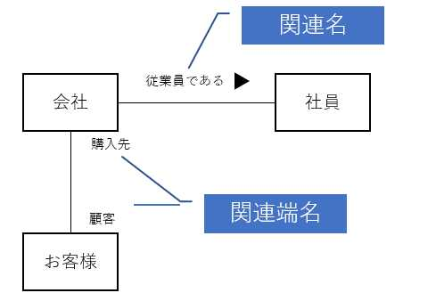
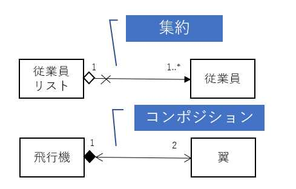
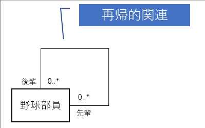
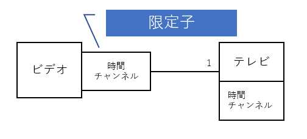
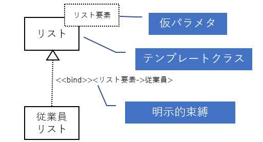
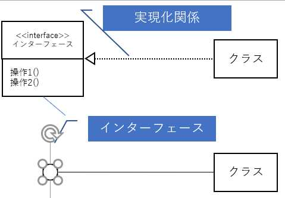
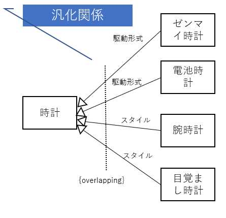

## クラス図
- オブジェクトを抽象化したものを図にした
- 書き方のイメージ↓

| クラス         |
| :-|
| 属性1 属性2 |
| 操作1 操作2 |

###### 項目
- クラス
    - **必須**
    - クラスの名前
    - 必ず１番上
    - パッケージ名を書きたい時：`パッケージ名::クラス名`
- 属性
    - 書かなくてもOK
    - Javaでいうフィールドみたいなやつ
    - 属性の値を書ける`属性名：属性の型=初期値`  
　Ex　⇒　年齢：int=0
- 操作
    - 書かなくてもOK
    - メソッドのこと
    - 引数と戻り値を書ける`操作名(引数名：引数の型)：戻り値の型`  
　Ex　⇒　年齢を追加する(追加する数値:int):void

#### 書き方色々

- **「+」(public)**…全てのクラスから
- **「-」(private)**…自分自身からのみ
- **「#」（protected)**…自分とサブクラスから
- **「～」(package)**…自分と同じパッケージから
- **「/」**…派生属性。他の要素から計算出来たりするが、合った方が良いアレ
- **下線を引く**…クラススコープとなる。（引かないとインスタンススコープ）
    - クラススコープ⇒要するにstaticなアレ
    - インスタンススコープ⇒オブジェクト毎に異なるアレ
- **「<<>>」**…ステレオタイプ。それ以下に書いてあるモノの拡張的な意味を持たせる。  
　　　　　次のステレオタイプが標記されるまで適応され続けるから注意。
- **{属性=値}**…メタ属性。クラスを作った人とかそんなやつを書くやつ。  
　　　　　クラスやオブジェクトに付ける。使う機会あるか、これ？
- **{制約}**…制約情報を入れる。`年齢{値は1以上}`とかこんな感じで使う

| << entity >>  従業員 {製作者=田中,作成日付=2018/01/04}       |
| :- |
| +従業員数：int=0 --------------------- +名前：string #生年月日 /年齢{値は１以上}    |
| << constractor >>  +作成(人):void ------------------ << control >> +検索():List<人> |

## 関連
クラス間に引く線のこと。次の３種類ある。
- 関連(集約含む)
- 依存(実現含む)
- 汎化

#### 関連
- **関連**…クラス間の線のこと。実線で標記。
- **関連名**…関連に名前を付けられる。▲で方向の指定もできる
- **関連端名**…他クラスから見た時の側面の名前を表現できる

- **集約**…全体とその一部の関係の場合に使う。全体側に変な◇を付加して標記
- **コンポジション**…集約の一部で、全体と一部のライフサイクルが同じ場合に使う。全体側に変な◆を付加して標記
- **多重度**…関連の端に数値を記入できる。それぞれ、要素間から見た数値。
    - 0以上の場合：`0..*または*`
    - 1から10の場合:`1..10`
    - 3の場合：`3`
- **方向性**…関連の線に矢印を入れると参照の方向を指定できる。×を付けると山荘できないことを表現できる。

- **再帰的関連**…同じクラスへ関連を引くことができる

- **限定子**…多重度を限定させることができる。大きな方に小さな四角を書き、その中に限定子属性を記載する。

- クラスの種類
    - インターフェース  
        - **<< interface >>** のステレオタイプを付けて標記  
        - **小さな丸（ロリポップ）**で標記もできる
    - テンプレートクラス
        - クラスを生成するクラス
        - クラスの右上に**点線の長方形**で囲って仮パラメタを置く。そこに値を入れると実際に使用可能なクラスを生成できる
        - `<<bind>>`付きの実現化関係で標記
        - 明示的束縛は関係で明示
        - 暗黙的束縛は生成するクラスの後ろに明示
        
    - ユーティリティクラス
        - `<<utility>>`のステレオタイプで標記
        - Utilクラスですよ、あれですよ
        - 他のクラスやプログラムからすべて参照可能なあれですよ
    - メタクラス
        - `<<metaclass>>`のステレオタイプで標記
        - 生成されるインスタンスがクラスであるクラス

#### 依存
- **依存関係**…参照するクラスなど、利用関係を表現する。点線の矢印で標記。
- **実現化関係**…インターフェースとクラスを関連付けるアレ  
　　　　　　**△の点線**で標記  

#### 汎化
- 継承と同じような考え。△のついた実線で標記。
- `Is-A`の関係とかほざいている。
- 要するにスーパークラスとサブクラスの関係。
- **区別子**…テキストラベルを使ってグループ分け可能
- **制約**…汎化に付与できる制約は次の４つ
    - **{overlapping}**…２つ以上のサブクラスを持つ可能性
    - **{disjoint}**…１つしかサブクラスを持てない
    - **{complete}**…下に新たなサブクラスを追加できない
    - **{incomplete}**…新たなサブクラスを追加できる

## 関連クラス
- クラスとクラスの関連するクラス
- 関連の線に**点線**を用いて標記
- 複数の関連（**N項関連**）を表すときは◇で記載する
