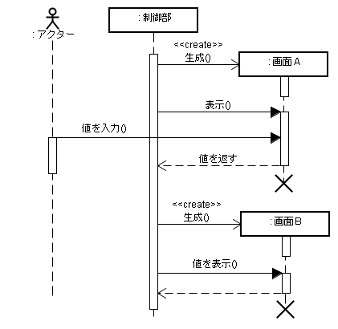
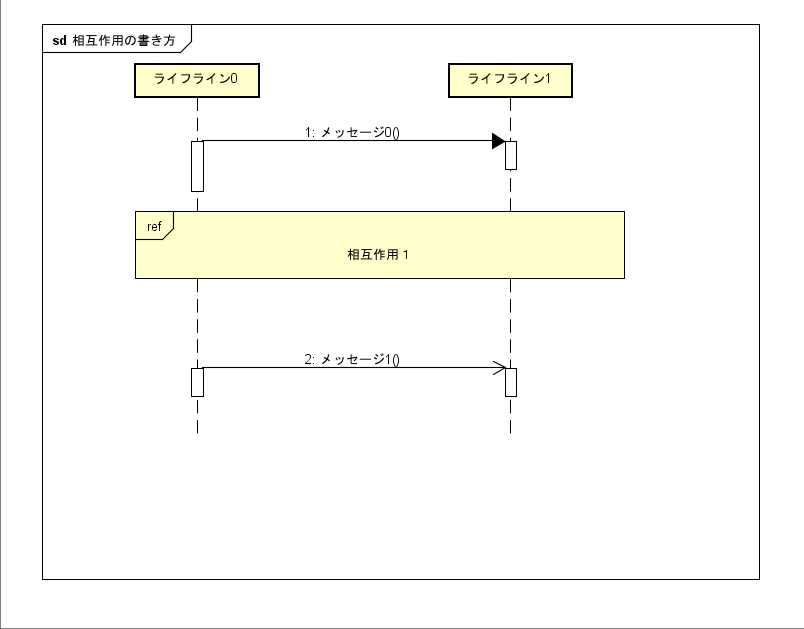
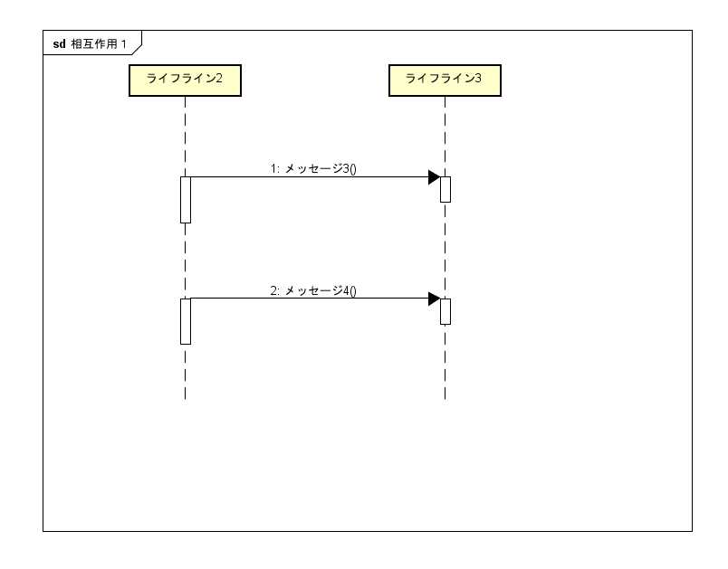
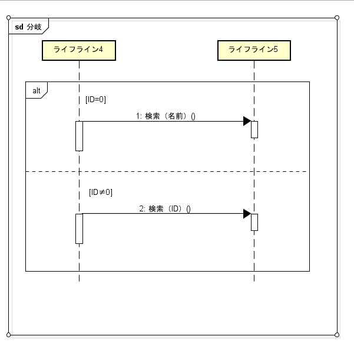
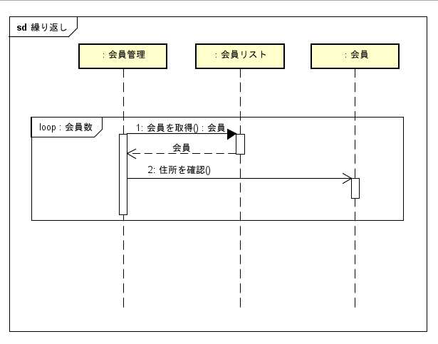
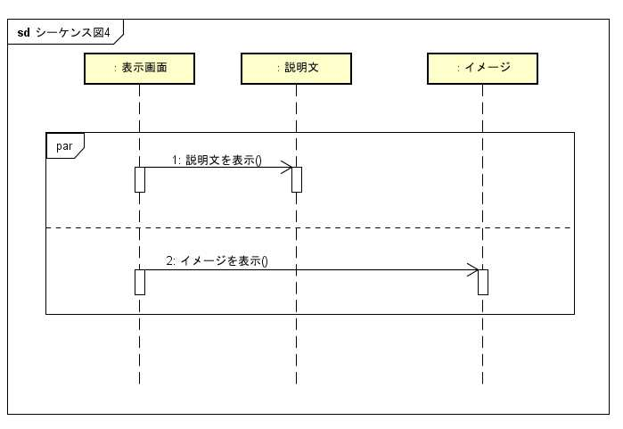
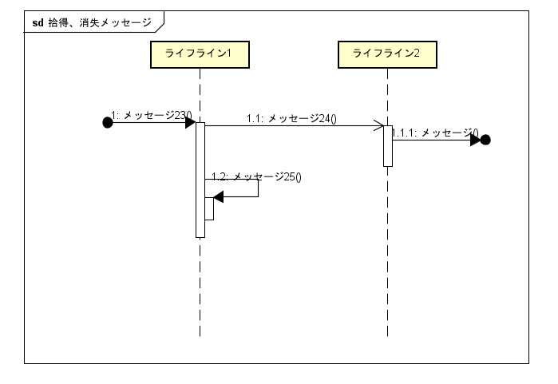
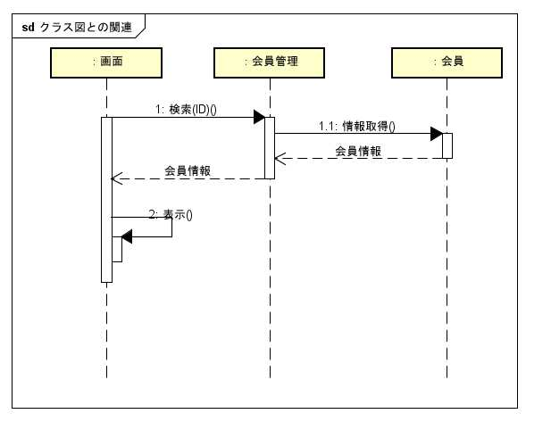
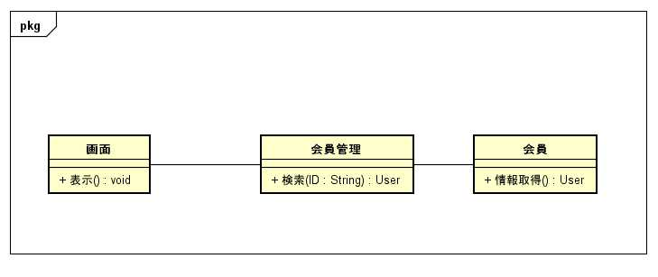

## 相互作用図

人ともの同士のメッセージのやり取りを表現する図。次の２つがある。
- シーケンス図
    - 上から下へ時系列でのメッセージのやり取り
- コミュニケーション図
    - 関係しているライフライン同士のメッセージのやり取りを表現

## シーケンス図

ライフライン同士のメッセージのやり取りを表す
- ライフライン
    - 長方形で表現
    - 表記方法は３つ
        - `役割名`
        - `役割名：クラス名`
        - `：クラス名`
    - 下に向かって**点線を引く**
    - **×印** でライフラインの消滅を示す
- メッセージ
    - **塗りつぶし矢印**…同期のメッセージを表す
    - **普通の矢印**…非同期のメッセージを表す
    - **点線矢印**…戻りを表す

## 色々な書き方

- **相互作用使用**   
別のフレームを参照できる。
    - 書き方：フレームヘッダに`ref`を入れ、参照先の作用名を記載  

- **処理の分岐**  
    - 書き方：フレームヘッダに`alt`を入れ、破線で区切り、`[ ]`内に条件を書く  

- **処理の繰り返し**  
    - 書き方：フレームヘッダに`loop`を入れ、`[ ]`内に繰り返し回数を書く  

- **並行処理**  
    - 書き方：フレームヘッダに`par`を入れ、破線で区切る  

- **送信元、受信先が明確でないメッセージ**  
　送信元が明確でない ＞ **拾得メッセージ**  
　受信先が明確でない ＞ **消失メッセージ**
    - 書き方：明確でない先を●で配置
- **再帰呼び出し**
    - 書き方：自分自身に対してメッセージを呼び出す
- **実行指定**  
メッセージの呼び出し制御と実行機関を表現
    - 書き方：ライフライン上に四角で表現  

## クラス図との関係

シーケンス図とクラス図は密接に関係しており、変換ができる
 
